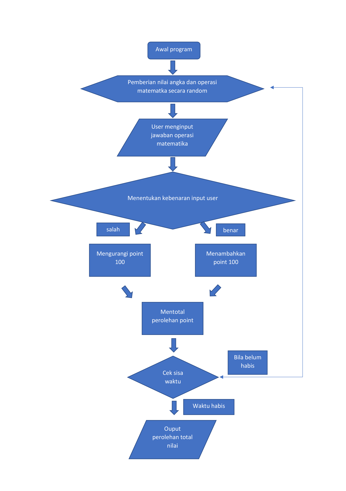
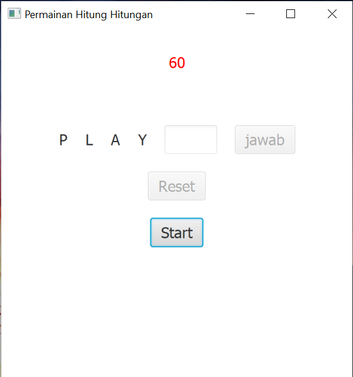

# Tubes-PBO
## Game hitung hitungan
```
menyelesaikan soal matematika sederhana selama 60 detik sebanyak-banyaknya
```
## Authors

* **Ahmad Hanif Nurfauzi {201810370311198}** - *Initial work* - [ahmadcah](https://github.com/ahmadcah)
* **Naufal Abrori {201810370311216}** - *Initial work* - [naufalabrori](https://github.com/naufalabrori)
* **Rizalul Fiqri {201810370311218}** - *Initial work* - TBA
* **Fathul Haqqi Sabilillah Jihadi {201810370311229}** - *Initial work* - [fathulhaqqi1](https://github.com/fathulhaqqi1)
## License

This project is licensed under the Apache License 2.0 - see the [LICENSE.md](https://github.com/ahmadcah/Tubes-PBO/blob/master/LICENSE) file for details
 
 ## About The Project
 
 <p align="center">
  <a href="https://github.com/ahmadcah/Tubes-PBO">
    
  </a>
  <h3 align="center">FLOWCHART</h3>
</p>

<p align="center">
  <a href="https://github.com/ahmadcah/Tubes-PBO">
    
  </a>
 <h3 align="center">preview 1</h3> 
</p>

<p align="center">
  <a href="https://github.com/ahmadcah/Tubes-PBO">
    
  </a>
 <h3 align="center">preview 2</h3>
</p>
 
  Project yang kami buat adalah sebuah soal perhitungan matematika sederhana yang terdiri dari 4 operator perhitungan yaitu tambah (+), kurang (-), bagi (/), dan kali (x), :smile:

  di rekomendasikan untuk menggunka JDK oracle 8
  
  bebas untuk clone dan direkomendasikan pakai intelij
  
  tidak ada library tambahan dalam program ini
  
  
  
  
 
 
  
  
  
 
 
  
 
 
  
  
 
 
  
 
 
  
  
  
 


 
